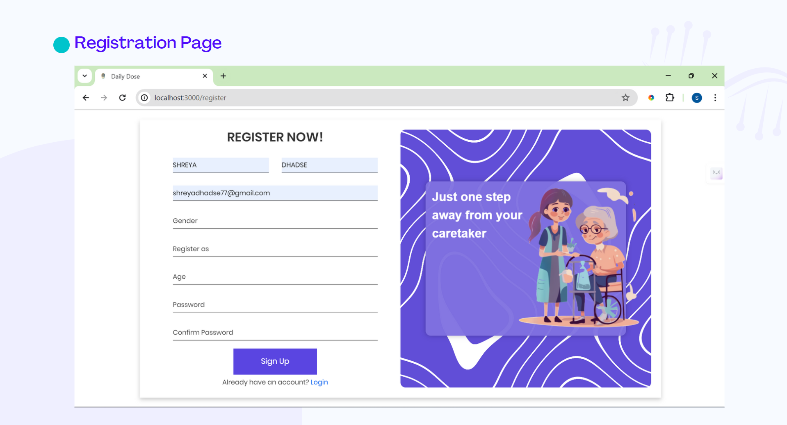
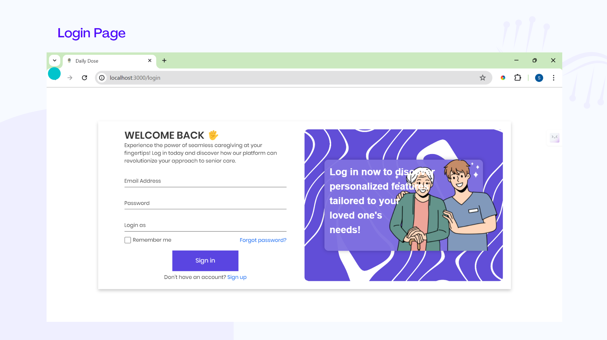
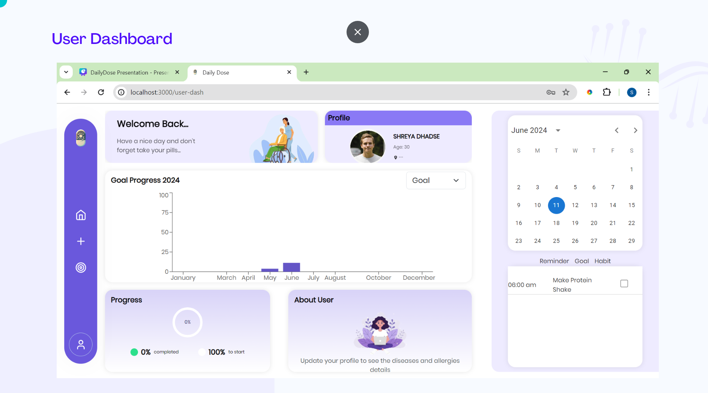
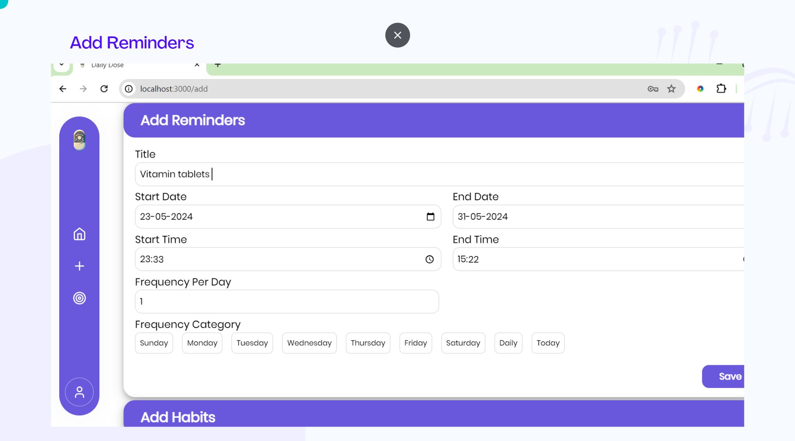
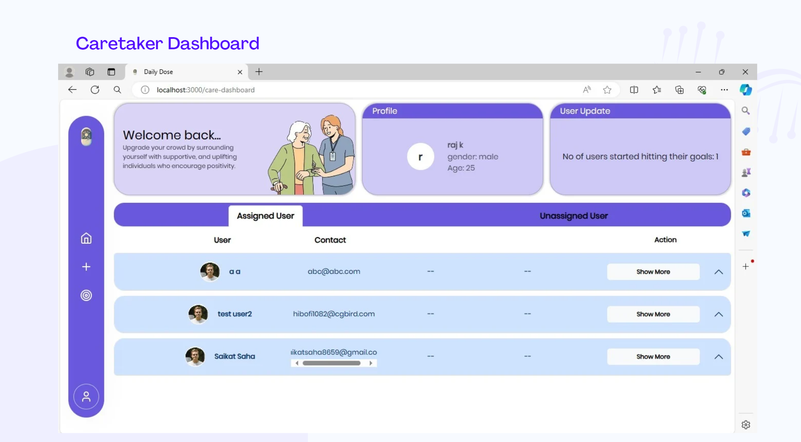
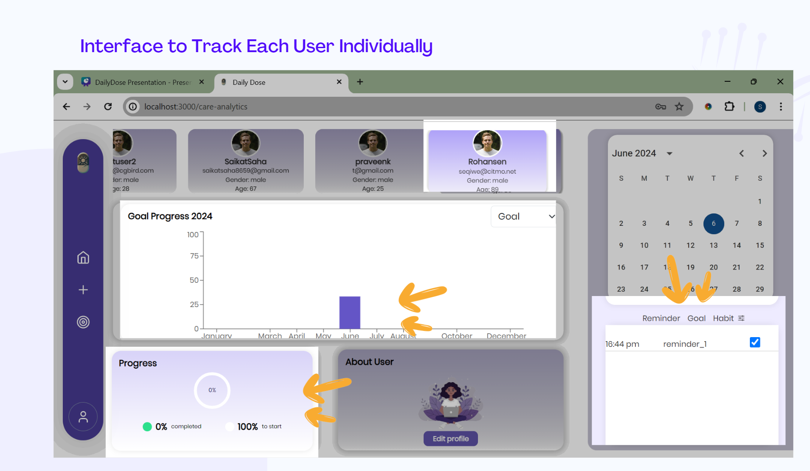

# DailyDose (Small Reminders, Big Impact)

## All important Links:
### * Figma Design [Link](https://www.figma.com/design/CoSvGwviBa7rTsNv6IlKO7/homepage?node-id=0-1).
### * API Documentation Sheet [Link](https://docs.google.com/spreadsheets/d/1q_Adq-6TksKps731yWW_AFL8jbdpGxMQN4PFIzxe3Es/edit#gid=1434529666).
### * Defect Sheet [Link](https://docs.google.com/spreadsheets/d/1V0xGBUllnQPWy0sOCA8rVPRWxWkYSzQInf1OMiAjmL0/edit#gid=0).
### * PPT [Link](https://www.canva.com/design/DAGGhe7lkIc/iDvyr-d2SzqKMUGnagGveg/edit).


### Objective:
The main objectives of this project are to develop a web application that allows users to:
* Create and manage goal reminders and habits
* Track and monitor progress
* Share reminders and habits with caretakers
* Receive reminders and notifications
  
### Scope:
The project will cover the following features:
* User Authentication: Secure user accounts with login and registration functionality

* CRUD Operations: Users can create, edit, and delete their goal reminders and habits seamlessly
  
* Caretaker Management: Caretakers can create and manage goal reminders and habits for users
  
* Reminder and Notification System: Users and caretakers can receive reminders and notifications for goal reminders and habits

### Proposed System:
DailyDose is a versatile web application accessible on various devices with web browsers.
It uses APIs for enhanced functionality and incorporate features for seamless goal reminder and habit management.

Features:
The following are the key features of the AirTracker application:
* User Authentication
* Post Creation, Editing, and Deletion

### Implementation Plan:
The following is a high-level implementation plan for the project:
1. Design a robust database schema for user data, goal reminders, and habits
2.  Develop a secure backend API handling user authentication, goal reminder and habit management, and caretaker management
3.  Create an interactive frontend user interface for a seamless user experience
4. Integrate frontend and backend components to ensure smooth functionality
5.  Test the application.


### Resources Required:
The following resources are required for the project:
* 	Frontend technologies:React
* 	Backend technologies: Node.js, Express.js, and MongoDB
* 	Basic tools: Git, GitHub, postman, and Visual Studio Code

### References:
The following resources will be used as references for the project:
* Online resources: YouTube, Google, Technologies Documentations, etc.
* Other resources: Mentor guidance.
<p align="right">(<a href="#top">Back to top</a>)</p>

## Requirements
- mongoDB
- express.js
- react.js
- node.js
- npm

## Getting started

To get started with this project, 
first install the npm dependencies for frontend and backend:

```bash
cd frontend
```

```bash
npm install
```

Next, run the development server:

```bash
npm run dev
```
Next, open localhost server:

```bash
localhost:5000
```

open another terminal 

```bash
cd backend
```
```bash
npm install
```
Next, run the development server:

```bash
npm run dev
```


### Output:


## Registration :


## Login:


## User's Dashboard :


## Add Reminders :


## CareTaker's Dashboard:


## Interface to Track User:



<p align="right">(<a href="#top">Back to top</a>)</p>


